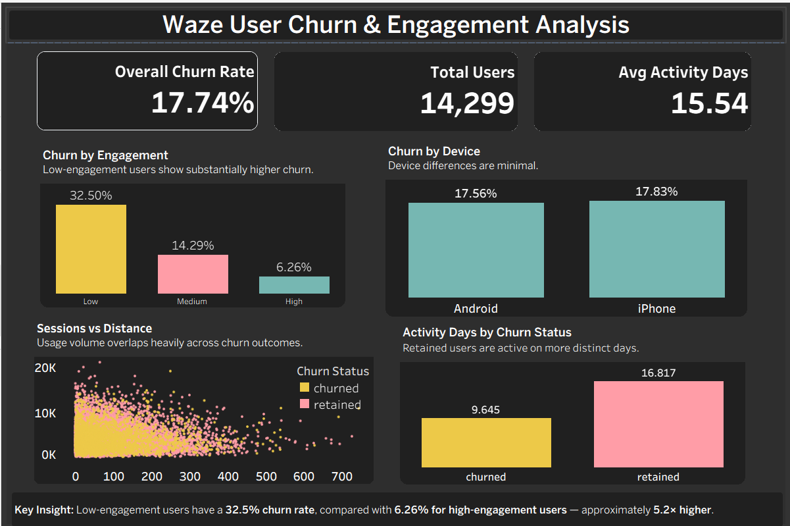

# Waze User Churn & Engagement Analysis

## Project Overview

This project analyzes user behavior in a Waze navigation-app dataset to understand which usage patterns are associated with customer churn.

The analysis focuses on a key business question:

> **Which user engagement patterns are associated with churn, and where could retention efforts be focused?**

I used **MySQL** for exploratory analysis, **Python (Pandas)** for deeper behavioral analysis and feature engineering, and **Tableau** to build an interactive churn dashboard.

## Tools Used

- **MySQL** — data exploration, aggregation, and churn analysis
- **Python (Pandas)** — data validation, feature engineering, segmentation, and behavioral analysis
- **Tableau** — interactive dashboard and data visualization

## Dataset

The analysis uses a public Waze user churn dataset containing user activity and driving behavior.

The churn analysis includes **14,299 users with known churn status**.

Key variables analyzed include:

- Sessions
- Drives
- Distance driven
- Activity days
- Driving days
- Device type
- Churn status

## Analysis Workflow

### 1. SQL Analysis

MySQL was used to explore the dataset and calculate:

- Overall churn rate
- Churn by device
- User activity patterns
- Engagement-level comparisons
- Usage behavior across churn groups

### 2. Python Analysis

Python and Pandas were used for additional validation and behavioral analysis.

Users were segmented into engagement tiers based on activity days:

| Engagement Tier | Activity Days |
|---|---:|
| Low | 0–10 |
| Medium | 11–20 |
| High | 21+ |

These thresholds are analytical segments created for this project rather than official Waze benchmarks.

### 3. Tableau Dashboard

An interactive Tableau dashboard was created to communicate the major findings and allow users to explore churn patterns across engagement level and device type.

## Key Findings

### Engagement frequency showed the strongest churn pattern

Low-engagement users had a **32.50% churn rate**, compared with:

- **14.29%** for medium-engagement users
- **6.26%** for high-engagement users

This means the observed churn rate among low-engagement users was approximately **5.2×** that of high-engagement users.

### Device type showed little difference

Churn rates were very similar across devices:

- Android: **17.56%**
- iPhone: **17.83%**

This suggests device type alone provides little separation between churn outcomes in this dataset.

### Retained users were active more consistently

Average activity days:

- Churned users: **9.65 days**
- Retained users: **16.82 days**

Although churned users sometimes showed relatively high raw usage volume, retained users used the app across more distinct days.

## Business Interpretation

The analysis suggests that **consistency of engagement is more closely associated with churn than device type or raw usage volume**.

Rather than focusing retention efforts simply on users with fewer sessions or lower distance travelled, a useful strategy to test would be identifying users whose active-day frequency is low or declining.

Potential retention experiments could include:

- Re-engagement campaigns for low-activity users
- Personalized reminders or navigation features
- Monitoring declines in activity frequency as an early churn signal
- A/B testing retention interventions and measuring subsequent retention

These findings describe associations in the dataset and should not be interpreted as proof that low engagement causes churn.

## Repository Contents

- `waze_churn_analysis.sql` — SQL analysis
- `Waze_Churn_Engagement_Analysis.ipynb` — Python/Pandas analysis
- `waze_churn_tableau.csv` — Tableau-ready dataset
- `waze_churn_dashboard.png` — dashboard preview

## Dashboard

An interactive version of this dashboard is available on **Tableau Public**.

[View Interactive Tableau Dashboard](https://public.tableau.com/views/WazeUserChurnEngagementAnalysis/Dashboard1?:language=en-US&publish=yes&:sid=&:redirect=auth&:display_count=n&:origin=viz_share_link)
